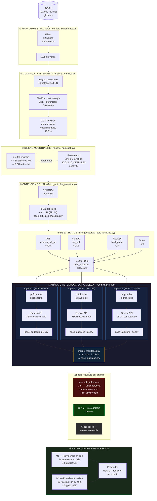

# Pipeline de Verificación Metodológica — Fallas Inferenciales

```mermaid
flowchart TD
    %% ── FUENTE DE DATOS ──
    DOAJ[(DOAJ\n~21.000 revistas\nglobales)]

    %% ── ETAPA 1: CONSTRUCCIÓN DE MARCO MUESTRAL ──
    subgraph E1["① MARCO MUESTRAL  (fetch_journals_sudamerica.py)"]
        F1[Filtrar\n12 países\nSudamérica]
        F2[2.780 revistas]
    end

    subgraph E2["② CLASIFICACIÓN TEMÁTICA  (analisis_tematico.py)"]
        F3[Asignar macroárea\n11 categorías LCC]
        F4[Clasificar metodología\nExp / Inferencial / Cualitativa]
        F5[2.037 revistas\ninferenciales / experimentales\n73.3%]
    end

    subgraph E3["③ DISEÑO MUESTRAL MEP  (diseno_muestral.py)"]
        direction LR
        F6["n = 327 revistas\nk = 10 artículos c/u\n→ 3.270 artículos"]
        F7["Parámetros:\nZ=1.96, E=±5pp\nICC=0.10, DEFF=1.90\nseed=42"]
    end

    %% ── ETAPA 2: OBTENCIÓN DE ARTÍCULOS ──
    subgraph E4["④ OBTENCIÓN DE URLs  (fetch_articulos_muestra.py)"]
        F8[API DOAJ\npor ISSN]
        F9["2.675 artículos\ncon URL (99.4%)\nbase_articulos_muestra.csv"]
    end

    %% ── ETAPA 3: DESCARGA DE PDFs ──
    subgraph E5["⑤ DESCARGA DE PDFs  (descargar_pdfs_articulos.py)"]
        direction LR
        S1["OJS\ncitation_pdf_url\n~79%"]
        S2["SciELO\nsci_pdf\n~14%"]
        S3["Redalyc\nhtml_parse\n~2%"]
        S4["Otros\n~5%"]
        F10["~2.200 PDFs\npdfs_articulos/\n~83% éxito"]
    end

    %% ── ETAPA 4: ANÁLISIS PARALELO ──
    subgraph E6["⑥ ANÁLISIS METODOLÓGICO PARALELO — Gemini 2.5 Flash"]
        direction TB

        subgraph AG1["Agente 1  (PDFs 0–356)"]
            A1[pdfplumber\nextrae texto]
            A2[Gemini API\nJSON estructurado]
            A3[base_auditoria_p1.csv]
        end

        subgraph AG2["Agente 2  (PDFs 357–713)"]
            B1[pdfplumber\nextrae texto]
            B2[Gemini API\nJSON estructurado]
            B3[base_auditoria_p2.csv]
        end

        subgraph AG3["Agente 3  (PDFs 714–fin)"]
            C1[pdfplumber\nextrae texto]
            C2[Gemini API\nJSON estructurado]
            C3[base_auditoria_p3.csv]
        end

        MERGE["merge_resultados.py\nConsolidar 3 CSVs\n→ base_auditoria.csv"]
    end

    %% ── ETAPA 5: ESTIMACIÓN ──
    subgraph E7["⑦ ESTIMACIÓN DE PREVALENCIAS"]
        M1["M1 — Prevalencia artículo\n% artículos con falla\n± 8 pp  IC 95%"]
        M2["M2 — Prevalencia revista\n% revistas con ≥1 falla\n± 5 pp  IC 95%"]
        EST["Estimador\nHorvitz-Thompson\npor estrato"]
    end

    %% ── VARIABLE RESULTADO ──
    subgraph VR["Variable resultado por artículo"]
        direction LR
        V1["incumple_inferencia\n🔴 Sí — usa inferencia\n+ muestra no prob.\n+ sin advertencia"]
        V2["🟢 No — metodología\ncorrecta"]
        V3["⚪ No aplica —\nno usa inferencia"]
    end

    %% ── CONEXIONES ──
    DOAJ --> E1
    F1 --> F2
    F2 --> E2
    F3 --> F4 --> F5
    F5 --> E3
    F6 -.->|parámetros| F7

    E3 --> E4
    F8 --> F9

    F9 --> E5
    S1 & S2 & S3 & S4 --> F10

    F10 --> AG1 & AG2 & AG3
    A1-->A2-->A3
    B1-->B2-->B3
    C1-->C2-->C3
    A3 & B3 & C3 --> MERGE

    MERGE --> VR
    VR --> E7
    M1 & M2 --> EST

    %% ── ESTILOS ──
    style E6 fill:#1a1a2e,stroke:#4a90d9,color:#fff
    style AG1 fill:#16213e,stroke:#4a90d9,color:#ccc
    style AG2 fill:#16213e,stroke:#4a90d9,color:#ccc
    style AG3 fill:#16213e,stroke:#4a90d9,color:#ccc
    style V1 fill:#4a1010,stroke:#e74c3c,color:#fff
    style V2 fill:#0a3d0a,stroke:#2ecc71,color:#fff
    style V3 fill:#2d2d2d,stroke:#aaa,color:#fff
    style E7 fill:#1a2a1a,stroke:#2ecc71,color:#fff
    style MERGE fill:#0d2137,stroke:#f39c12,color:#fff
```
